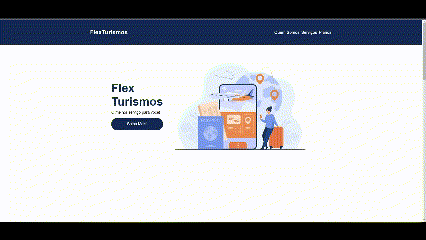
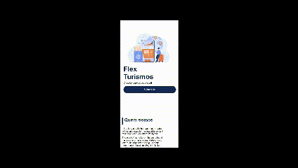

# my-study
This repository is to include all of my study repositories at one place

## Table of Contents
- [Overview](#overview)
    - [Frontend](#frontend)
- [Useful Resources](#useful-resources)
- [Author](#author)

 

## Overview
- [Front-end](#bfront-endb)
---

### <b id="frontend">Frontend</b> &nbsp; &nbsp; &nbsp; 
Currently, I have 3 frontend projects, and my best frontend project is <a>"Flex Turismo"</a> developed to <b>Spread Fullstack Developer</b> from [Digital Innovation One](https://www.dio.me/en).  

 

#### <a href="https://github.com/bemibrando/website-study/tree/main/frontend/flex-turismo">Flex Turismo</a>

The project goals was develop a landing page using the knowledge about HTML markups and Flexbox earned with the section "HTML/CSS3" from the course.

### <b id="screenshot">Screenshot</b>

    
    

- Solution URL: [GitHub Repository](https://github.com/bemibrando/website-study/tree/main/frontend/flex-turismo)
- Live Site URL: [GitHub Pages](https://bemibrando.github.io/website-study/frontend/flex-turismo/)

  

## Useful resources
---
- [Dio - Digital Innovation One](https://www.dio.me/en) - Dio.me is the platform for you to learn from experts, master the main technologies and enter the most desired companies faster.
- [Shields.io](https://shields.io/) - Shields.io is a service that allows you to generate badges for your projects.

  

## Author
---

    <figure>
        <a href="https://github.com/bemibrando" target="_blank">
              
            <b>Bianca Emi</b>
        </a>
    </figure>
    
Made with ♥ by <a href="https://github.com/bemibrando" target="_blank">Bianca Emi</a> 👋 Get in touch!

    

           
           
         
    

