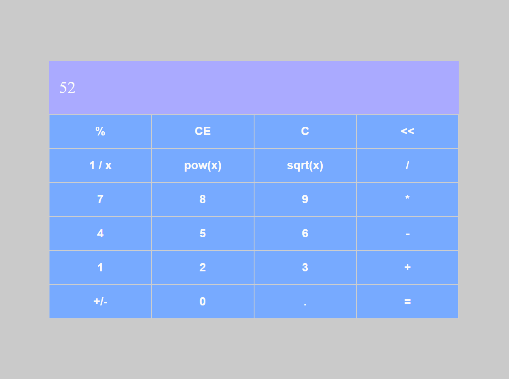
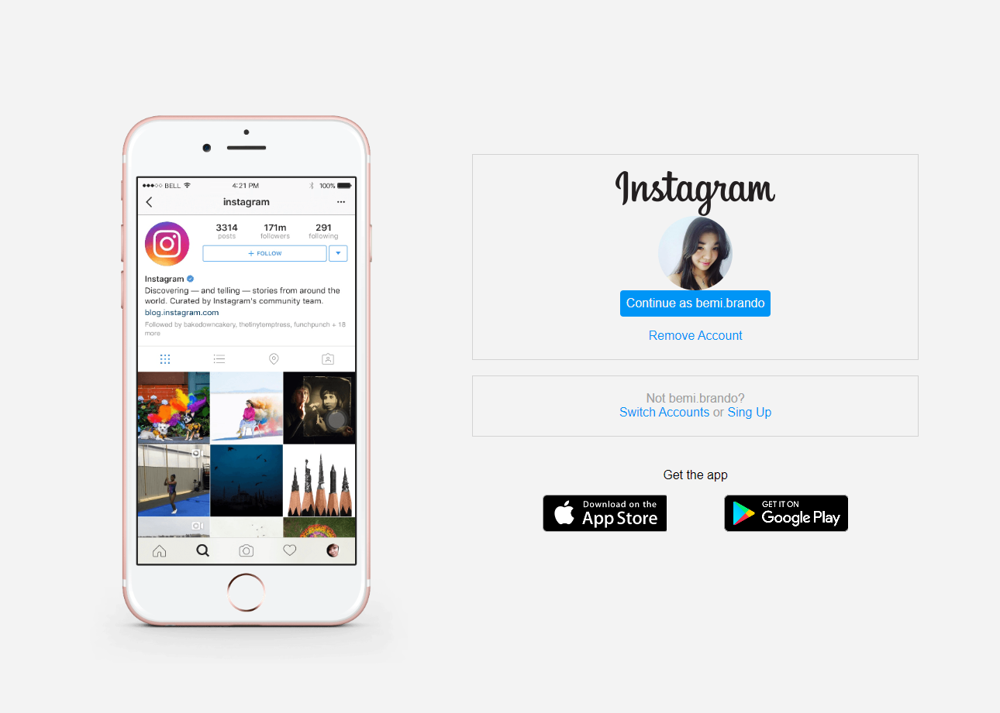

# Frontend
Here is only my frontend study projects.

## Table of Contents
- [Frontend](#bfrontendb)
  - [Calculator](#calculator)
  - [GitHub Wiki](#github-wiki)
  - [Flex Turismo](#flex-turismo)
  - [Dio Webpage](#dio-homepage)
  - [Re-Insta Home](#re-insta-home)
- [Useful Resources](#useful-resources)
- [Author](#author)

 

## <b>Frontend</b>

 

### <a href="https://github.com/bemibrando/website-study/tree/main/frontend/calculator"><b id="calculator">Calculator</b></a> &nbsp; &nbsp; &nbsp;  &nbsp; 
Solution developed to <b>Orange Tech +</b> from [Digital Innovation One](https://www.dio.me/en).  
The project goals was develop a calculator using the knowledge about `ReactJs` to build a componentized website and styled-components and react-router-dom to help.

 

<b>Build with: </b> &nbsp;   

- Solution URL: [GitHub Repository](https://github.com/bemibrando/website-study/tree/main/frontend/calculator)

Screenshot

 

    

 

### <a href="https://github.com/bemibrando/website-study/tree/main/frontend/github-wiki"><b id="github-wiki">GitHub Wiki</b></a> &nbsp; &nbsp; &nbsp;  &nbsp; 
The project goals was develop a page consuming GitHub API to show up repositories using the knowledge about `ReactJs` to build a componentized website and styled-components to help.

 

<b>Build with: </b> &nbsp;   

- Solution URL: [GitHub Repository](https://github.com/bemibrando/website-study/tree/main/frontend/github-wiki)

Screenshot

 

    

 

### <a href="https://github.com/bemibrando/website-study/tree/main/frontend/flex-turismo"><b id="flex-turismo">Flex Turismo</b></a> &nbsp; &nbsp; &nbsp;  &nbsp; 
Solution developed to <b>Spread Fullstack Developer</b> from [Digital Innovation One](https://www.dio.me/en). 
The project goals was develop a landing page using the knowledge about HTML markups and Flexbox earned with the section "HTML/CSS3" from the course.

 

<b>Build with: </b> &nbsp; 

 

- Solution URL: [GitHub Repository](https://github.com/bemibrando/website-study/tree/main/frontend/flex-turismo)
- Live Site URL: [GitHub Pages](https://bemibrando.github.io/website-study/frontend/flex-turismo/)

Screenshot

 

    
    

 

### <a href="https://github.com/bemibrando/website-study/tree/main/frontend/dio-webpage"><b id="dio-homepage">Dio HomePage</b></a> &nbsp; &nbsp; &nbsp;  &nbsp; 
Solution developed to <b>Orange Tech +</b> from [Digital Innovation One](https://www.dio.me/en). 
The project goals was develop Dio's `homepage`, `login` page and `feed` page using the knowledge about `ReactJs` to build a componentized website and styled-components and react-router-dom to help.

 

<b>Build with: </b> &nbsp;   

 

- Solution URL: [GitHub Repository](https://github.com/bemibrando/website-study/tree/main/frontend/dio-webpage)

Screenshot

 

    

 

### <a href="https://github.com/bemibrando/website-study/tree/main/frontend/re-insta-home"><b id="re-insta-home">Re-Insta Home</b></a> &nbsp; &nbsp; &nbsp;  &nbsp; 
Solution developed to <b>Spread Fullstack Developer</b> from [Digital Innovation One](https://www.dio.me/en). 
The challenge was to build a project using a instagram page that was availiable to me.

 

<b>Build with: </b> &nbsp; 

 

- Solution URL: [GitHub Repository](https://github.com/bemibrando/website-study/tree/main/frontend/re-insta-home)
- Live Site URL: [GitHub Pages](https://bemibrando.github.io/website-study/frontend/re-insta-home/)

Screenshot

 

    
    
    

  

## Useful resources

- [Dio - Digital Innovation One](https://www.dio.me/en) - Dio.me is the platform for you to learn from experts, master the main technologies and enter the most desired companies faster.

  

## Author

    <figure>
        <a href="https://github.com/bemibrando" target="_blank">
              
            <b>Bianca Emi</b>
        </a>
    </figure>
    
Made with ♥ by <a href="https://github.com/bemibrando" target="_blank">Bianca Emi</a> 👋 Get in touch!

    

           
           
         
    

