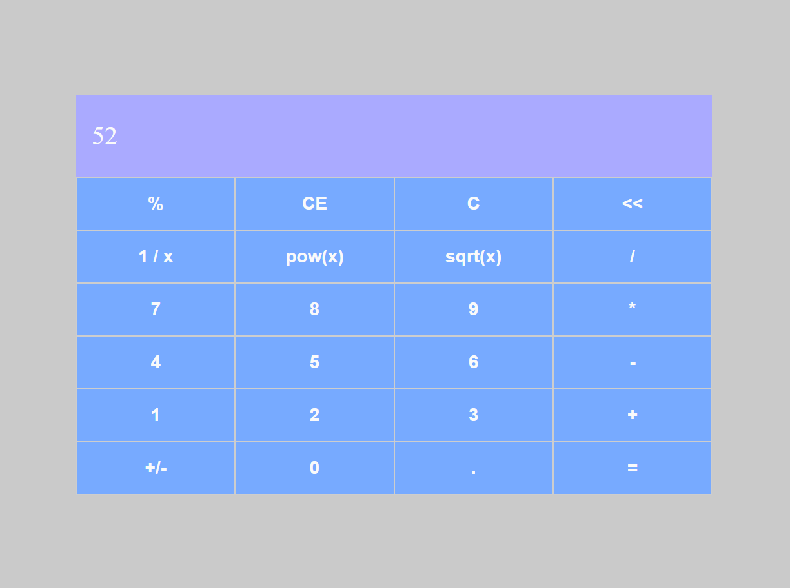

# Orange Tech + - Calculator &nbsp; &nbsp; &nbsp;  &nbsp; 

This is a solution to `Orange Tech+` from [Digital Innovation One](https://www.dio.me/en). Dio.me is the platform for you to learn from experts, master the main technologies and enter the most desired companies faster.

 
<b>Build with:</b>  

## Table of contents

- [Overview](#overview)
  - [The challenge](#the-challenge)
  - [Screenshot](#screenshot)
  - [Links](#links)
- [My process](#my-process)
  - [Built with](#built-with)
  - [What I learned](#what-i-learned)
- [Useful Resources](#useful-resources)
- [Author](#author)
- [Acknowledgments](#acknowledgments)

 

## Overview

### <b id="the-challenge">The challenge</b>
- The project goals was develop a calculator using the knowledge about `ReactJs` to build a componentized website and styled-components and react-router-dom to help.

### <b id="screenshot">Screenshot</b>

    

 

### <b id="links">Links</b>
- Solution URL: [GitHub Repository](https://github.com/bemibrando/website-study/tree/main/frontend/calculator)
- Live Site URL: [GitHub Pages](https://bemibrando.github.io/website-study/frontend/calculator/)

 

## My process

### <b id="built-with">Built with</b>

- Semantic HTML5 markup
- CSS custom properties
- ReactJs
- styled-components
- React Router Dom

 

### <b id="what-i-learned">What I learned</b>
- How to code Javascript with CSS using `styled-compnents`
- How to use `React Router` to routing

 

## Useful Resources

- [DIO.me - Digital Innovation One](https://www.dio.me/en) - Dio.me is the platform for you to learn from experts, master the main technologies and enter the most desired companies faster.

 

## Author

    <figure>
        <a href="https://github.com/bemibrando" target="_blank">
              
            <b>Bianca Emi</b>
        </a>
    </figure>
    
Made with ♥ by <a href="https://github.com/bemibrando" target="_blank">Bianca Emi</a> 👋 Get in touch!

    

           
           
         
    

 

## Acknowledgments

» Pablo Henrique - Who taught to carry out this project

