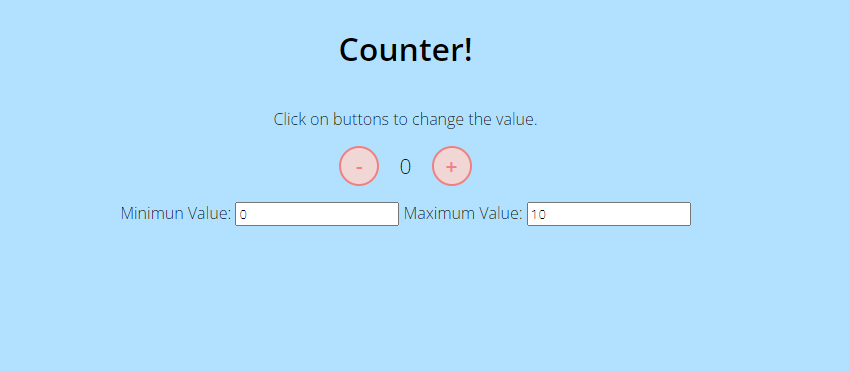

# Counter &nbsp; 

A simple counter, increment by 1 when you click on "+" button and decrement by 1 when you click on "-" button.

  

<b>Build with:</b>  

## Table of contents

- [Overview](#overview)
  - [The challenge](#the-challenge)
  - [Project Composition](#project-composition)
  - [Screenshot](#screenshot)
  - [Links](#links)
- [Author](#author)

## Overview

### The Challange
Develop a counter that increments and decrements when clicking the button.

### Project Composition
- Increment by 1 when you click on "+" button.
- Decrement by 1 when you click on "-" button.

Extra Compositions
- When the `CURRENT_NUMBER` number is negative, the text color changes to red.
- It has conditionals that disable the increment or decrement button when `CURRENT_NUMBER` reaches defined value.
- Events were implemented using the `addEventListener` method.

### Screenshot

    

### Links
- solution URL: [GitHub Repository](https://github.com/bemibrando/website-study/tree/main/frontend/counter)
- Live Site URL: [GitHub Pages](https://bemibrando.github.io/website-study/frontend/counter)

## Author

    <figure>
        <a href="https://github.com/bemibrando" target="_blank">
              
            <b>Bianca Emi</b>
        </a>
    </figure>
    
Made with ♥ by <a href="https://github.com/bemibrando" target="_blank">Bianca Emi</a> 👋 Get in touch!

    

           
           
         
    

