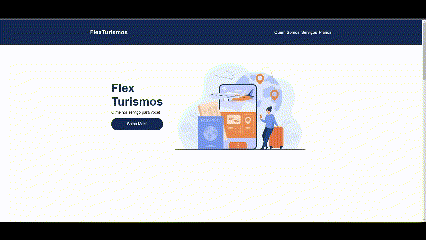

# Spread Fullstack Developer - Flex Turismo &nbsp; &nbsp; &nbsp; 
 &nbsp; 

This is a solution to [Spread Fullstack Developer] from [Digital Innovation One](https://www.dio.me/en). Dio.me is the platform for you to learn from experts, master the main technologies and enter the most desired companies faster.

## Table of contents

- [Overview](#overview)
  - [The challenge](#the-challenge)
  - [Screenshot](#screenshot)
  - [Links](#links)
- [My process](#my-process)
  - [Built with](#built-with)
  - [What I learned](#what-i-learned)
- [Author](#author)

 

## Overview
---

### <b id="the-challenge">The challenge</b>
- The project goals was develop a landing page using the knowledge about HTML markups and Flexbox earned with the section "HTML/CSS3" from the course.

### <b id="screenshot">Screenshot</b>

    
    

### <b id="links">Links</b>
- Solution URL: [GitHub Repository]()
- Live Site URL: [GitHub Pages]()

 

## My process
---

### <b id="built-with">Built with</b>

- Semantic HTML5 markup
- CSS custom properties
- Flexbox
- CSS Grid

### <b id="what-i-learned">What I learned</b>
I learn how to create cards and organize site components with "container-outside"

## Author
---

    <figure>
        <a href="https://github.com/bemibrando" target="_blank">
              
            <b>Bianca Emi</b>
        </a>
    </figure>
    
Made with ♥ by <a href="https://github.com/bemibrando" target="_blank">Bianca Emi</a> 👋 Get in touch!

    

           
           
         
    

