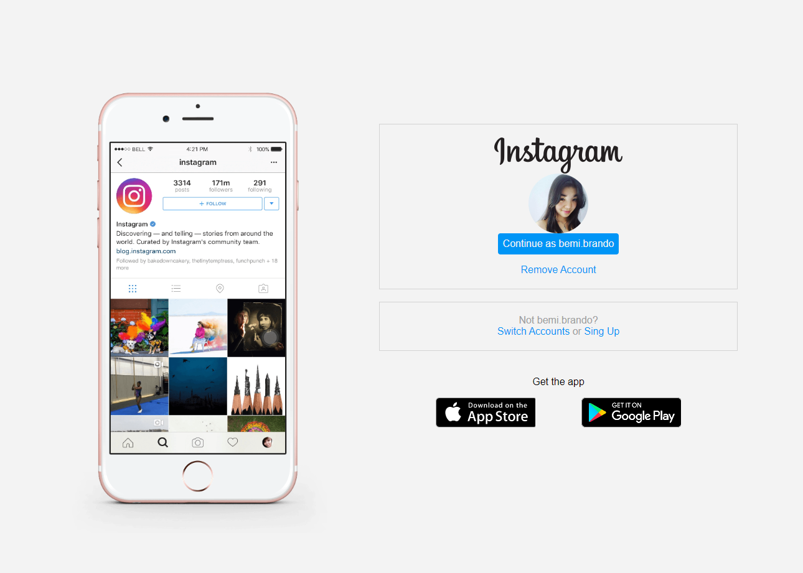
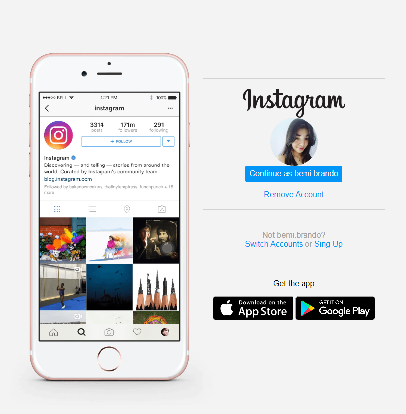
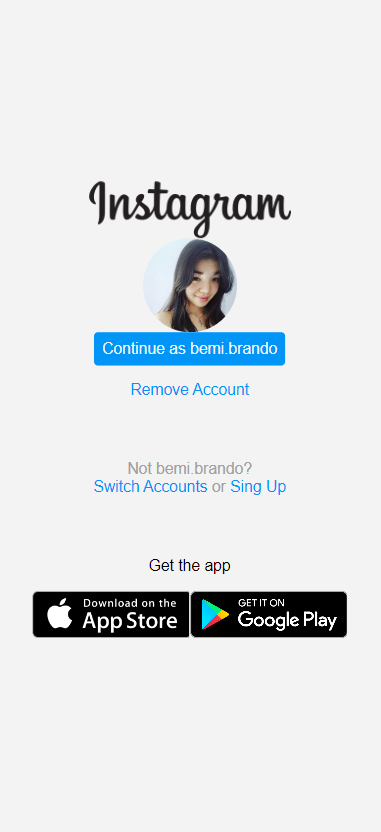

# Spread Fullstack Developer - Recreating the Instagram Page Solution &nbsp; &nbsp; &nbsp;  &nbsp; 
This is a solution to [Spread Fullstack Developer] from [Digital Innovation One](https://www.dio.me/en). Dio.me is the platform for you to learn from experts, master the main technologies and enter the most desired companies faster.
  
<b>Build with:</b>  

 

## Table of Contents
- [Overview](#overview)
    - [The Challenge](#the-challenge)
    - [Screenshot](#screenshot)
    - [Links](#links)
- [My Process](#my-process)
    - [Build With](#build-with)
    - [What I Learned](#what-i-learned)
- [Author](#author)

## Overview
---
### The Challenge
- the challenge was to build a project using a instagram page that was availiable to me

### Screenshot

    
    
    

### Links
- Solution URL: [GitHub Repository](https://github.com/bemibrando/website-study/tree/main/frontend/re-insta-home)
- Live Site URL: [GitHub Pages](https://bemibrando.github.io/website-study/frontend/re-insta-home/)

 

## My Process
---

### Build with
- Semantic HTML5 markup
- CSS custom properties
- Flexbox

### What I learned
With this project, I understand better how "display: flex" works

 

## Author
---

    <figure>
        <a href="https://github.com/bemibrando" target="_blank">
              
            <b>Bianca Emi</b>
        </a>
    </figure>
    
Made with ♥ by <a href="https://github.com/bemibrando" target="_blank">Bianca Emi</a> 👋 Get in touch!

    

           
           
         
    

