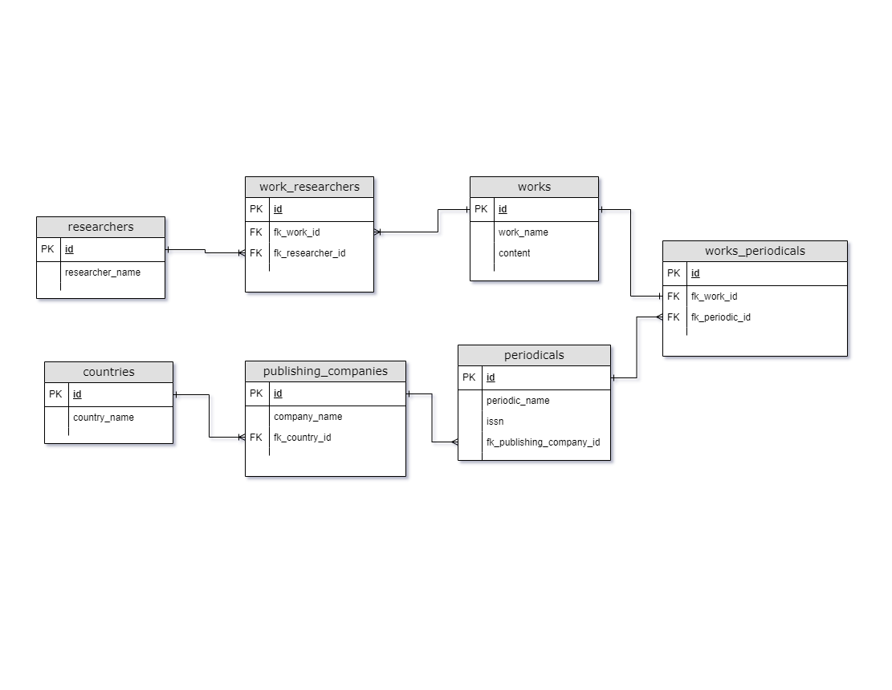

# MySQL - Periodicals &nbsp; &nbsp; &nbsp;  &nbsp; 

This is a solution to building a schema of periodicals from [Digital Innovation One](https://www.dio.me/en).

This is a SQL solution for MySQL to create a `schema` for manipulation of periodicals data.

  

<b>Build with:</b>  

## Table of contents

- [Overview](#overview)
  - [The challenge](#the-challenge)
  - [Entity Relationship Diagram](#erd)
- [Useful Resources](#useful-resources)
- [Author](#author)
- [Acknowledgments](#acknowledgments)

 

## Overview

### <b id="the-challenge">The challenge</b>
- The project goals was create a schema for the relationshionship of `publishing company`, `researchers` and `works`.

### <b id="erd">Entity Relationship Diagram</b>

    

## <b id="useful-resources">

- [Dio - Digital Innovation One](https://www.dio.me/en) - Dio.me is the platform for you to learn from experts, master the main technologies and enter the most desired companies faster.
- [MySQL](https://www.mysql.com/) - An open source relational database management system with a client-server model.

  

## Author

    <figure>
        <a href="https://github.com/bemibrando" target="_blank">
              
            <b>Bianca Emi</b>
        </a>
    </figure>
    
Made with ♥ by <a href="https://github.com/bemibrando" target="_blank">Bianca Emi</a> 👋 Get in touch!

    

           
           
         
    

## Acknowledgments

» Juliana Mascarenhas - Taught me how to develop a pokedex that displays multiple pokemons

    
    

